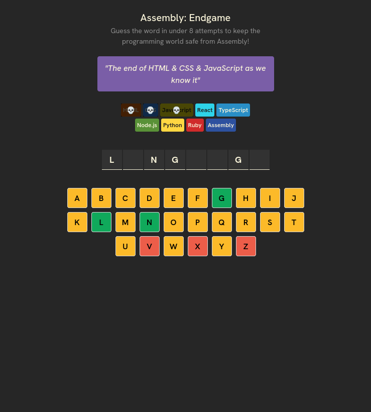

# Assembly: Endgame 

Gra przeglądarkowa typu "Wisielec". Odgadnij wylosowane słowo w mniej niż 8 próbach, aby uratować nowoczesne języki programowania przed zagładą i koniecznością pisania wyłącznie w Assembly.

##  Podgląd projektu

## Technologie

* **React 19**
* **Vite**
* **Tailwind CSS**
* **React Confetti**
